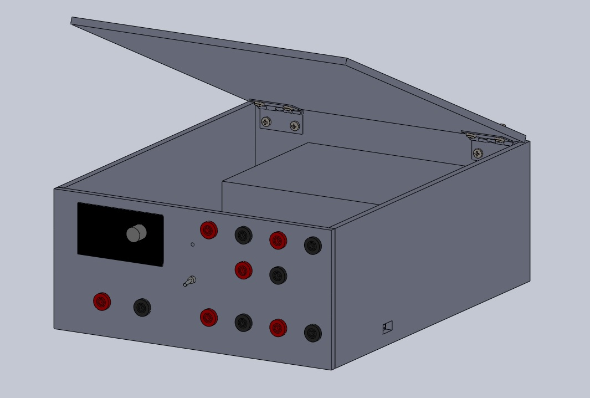
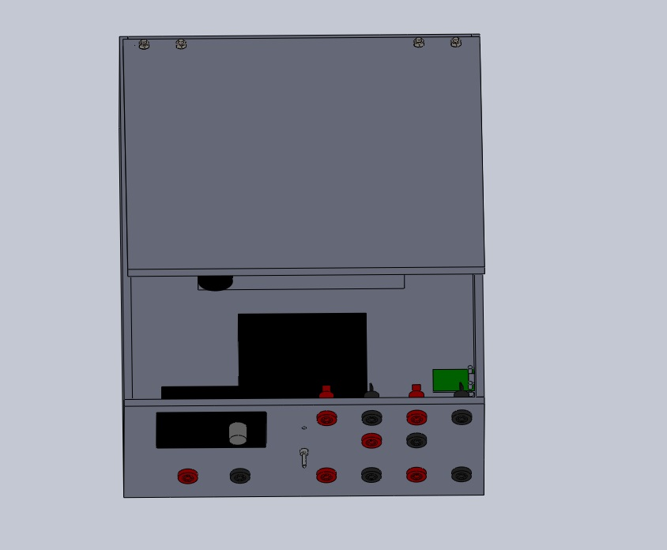
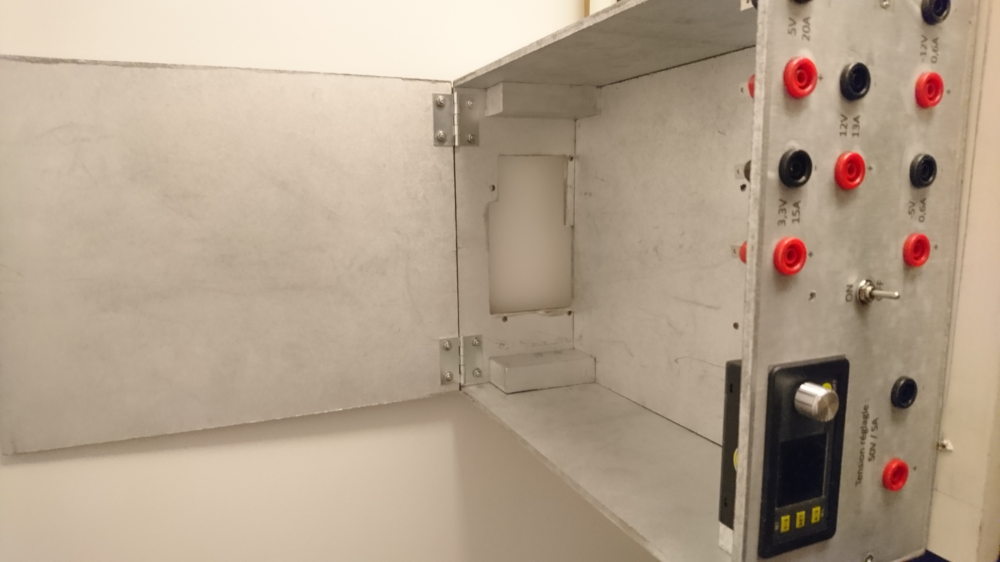
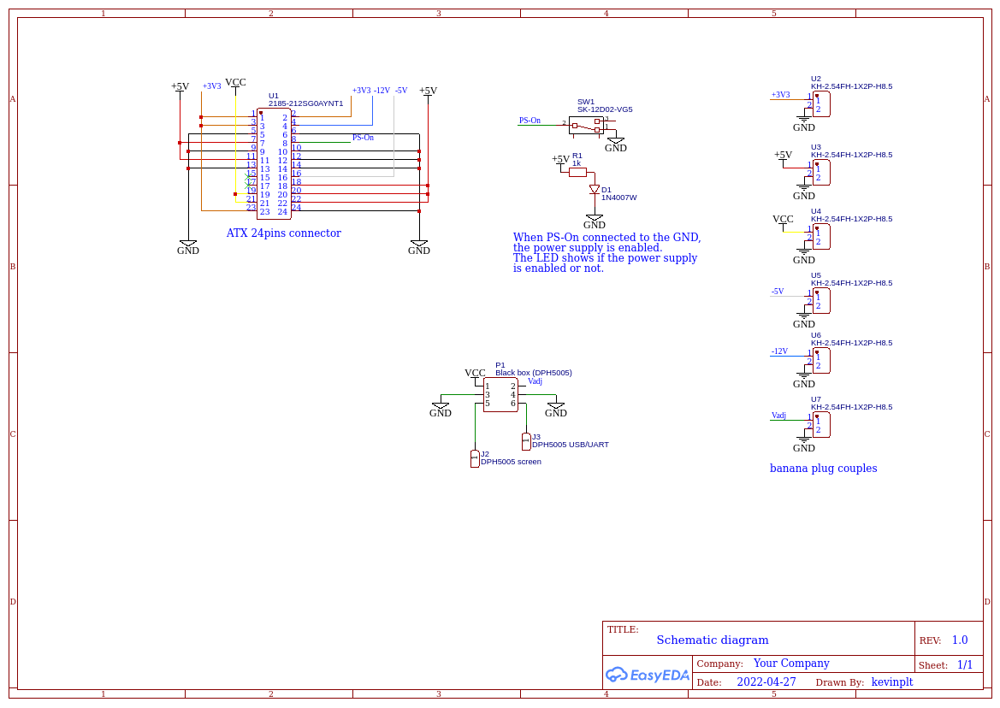

# DIY-stabilized-power-supply

## Description of the projet

The aim of the project is to make a wood box in order to create a stabilized power supply from an old ATX PC power supply with a lot of accessible voltages. It is also recommended to have an adjustable power supply, so it will embed a system to do this.

## Prerequisite
### For the wood box
- MDF wood 5mm thick
- wood cleats
- 2 hinges
- 8 M3x6mm philips metal screws
- 8 M3 nuts
- 8 M3 washers
- wood screws
- clear sticky paper for the front silkscreen

### For the features
- An old ATX PC power supply (330W)
- 6 red [banana plugs](https://fr.aliexpress.com/item/32803531060.html?spm=a2g0o.order_list.0.0.29285e5bcCjFoV&gatewayAdapt=glo2fra) 
- 6 black banana plugs
- Adjustable power suply controller : [DPH 5005](https://fr.aliexpress.com/item/32840324731.html?spm=a2g0o.order_list.0.0.29285e5bcCjFoV&gatewayAdapt=glo2fra)
- 1 toggle switch ([SPDT](https://fr.aliexpress.com/item/32681503480.html?spm=a2g0o.order_list.0.0.5c265e5b4IiR1h&gatewayAdapt=glo2fra))
- 1 LED (in my setup it is blue)
- 1 resistor (1 kohm)
- wires

## Assembly Modeling
Made with Solidworks 2017.
In this assembly, the wood cleats are not shown.

## Mechanism
- Edited with Solidworks 2017
- Exported from Solidworks to DXF each part of the box
- Exported from [Inkscape](https://github.com/inkscape/inkscape) to SVG each part
- Computed toolpath (gcode) with makercam software (makercam.swf) by defining every operations (this software takes in input only SVG files and it is deprecated)
- Execute gcode for each part with [bCNC](https://github.com/vlachoudis/bCNC) with Shapeoko 3

## Final Assembly
Dimensions of the wood box : (WidthxHeightxDepth) 261x124x330mm

## Connections into the wood box

This is a schematic diagram. It shows the idea how it is connected inside the wood box.

## Thanks
To [Vasilis Vlachoudis](https://github.com/vlachoudis) having created the bCNC project.
